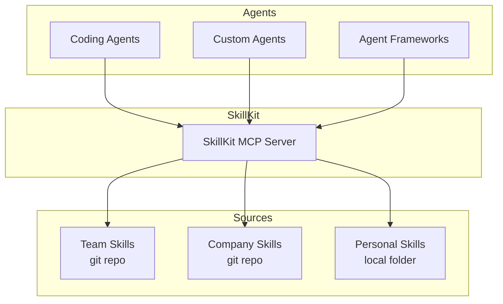

# What Is SkillKit?

SkillKit is an MCP server that makes it easy to share and distribute AI agent skills across your team and tools.

## The Problem

AI agent skills encode how your organization works - coding standards, deployment processes, security practices, domain knowledge. The [skill format](https://agentskills.io) is an open standard supported by major AI coding tools.

But there's a gap: **skills are easy to create, hard to govern at scale.**

| Challenge | Enterprise Impact |
|-----------|-------------------|
| **No central distribution** | 500 developers, each managing skills locally. No consistency, no control. |
| **No version control** | A skill breaks production. Who changed it? Can you rollback? |
| **No standardization** | Teams duplicate effort. Best practices stay siloed. |
| **Tool fragmentation** | GitHub Copilot, custom agents, different frameworks - each needs separate skill setup. |

## The Solution

SkillKit serves skills over [MCP](https://modelcontextprotocol.io/) (Model Context Protocol):



**One server, any agent.** Connect your coding agent, custom agent, or agent framework to the same SkillKit server. They all get the same skills.

**Git-native.** Skills live in git repositories. Version them, branch them, review changes via PR, rollback when needed.

**Remote repos.** Point SkillKit at a git URL and it clones automatically. Pin to a branch, tag, or commit.

## Key Concepts

### Skills

A skill is a folder containing a `SKILL.md` file with instructions for the AI agent:

```
my-skill/
├── SKILL.md           # Required: instructions and metadata
├── scripts/           # Optional: executable code
│   └── validate.py
└── references/        # Optional: documentation, schemas
    └── api-spec.json
```

The agent discovers skills automatically and loads them based on the task.

### Prompts

Prompts are user-triggered entry points - like slash commands. They explicitly invoke skills:

```
/code-review    →  Loads the code-review skill
/deploy-prod    →  Loads the deployment skill
```

Not every skill needs a prompt. Prompts are for workflows users trigger directly.

### MCP (Model Context Protocol)

MCP is a standard protocol for AI agents to communicate with external tools. SkillKit exposes skills through MCP tools that any compatible agent can call.

## When to Use SkillKit

### Good Fit

| Scenario | Why SkillKit Helps |
|----------|-------------------|
| **Team sharing** | Distribute skills via git, everyone stays in sync |
| **Multiple AI tools** | One skill source serves all your MCP-compatible agents |
| **Version control** | Pin skill versions, test changes before rollout |
| **Custom agents** | Add skills to agent frameworks via MCP |

### May Not Need It

| Scenario | Alternative |
|----------|-------------|
| **Individual developer** | Native filesystem skills work fine |
| **Single AI tool** | Tool's built-in skill support may suffice |
| **Simple use case** | Local skills folder is simpler |

## What's Next

Ready to try it?

- [Installation](installation.md) - Get SkillKit running
- [Quick Start](quick-start.md) - Create and use your first skill in 5 minutes
