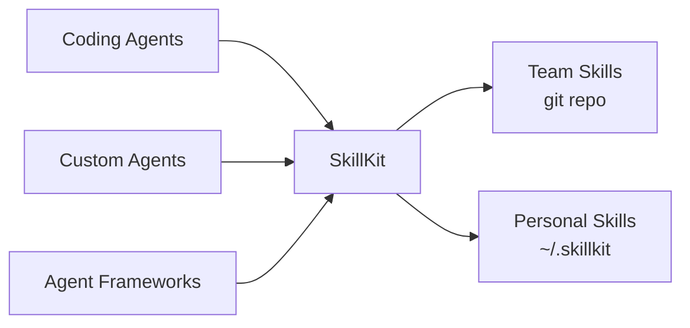

# SkillKit Documentation

SkillKit is an MCP server for sharing AI agent skills across your team and tools.

## What Are Skills?

[AI agent skills](https://agentskills.io) are folders containing instructions, scripts, and references that teach AI agents how to perform specific tasks. A skill might teach an agent how to:

- Review code according to your team's standards
- Deploy to your specific infrastructure
- Generate documentation in your preferred format

The skill format (SKILL.md) is an open standard supported by major AI coding tools.

## Why SkillKit?

Native skills work great for individual developers. But sharing skills across teams or using multiple AI tools gets complicated:

- How do you distribute skills to your team?
- How do you version and update them?
- What about custom agents that don't have native skill support?

SkillKit solves this by serving skills over MCP:

## Getting Started

1. [Quick Start](getting-started/quick-start.md) - Get running in 5 minutes
2. [What Is SkillKit?](getting-started/what-is-skillkit.md) - Understand the concepts
3. [Installation](getting-started/installation.md) - Detailed setup

## Guides

- [Skill Repositories](guide/skill-repositories.md) - Create and share skill repos
- [Creating Skills](guide/creating-your-first-skill.md) - Write effective skills
- [Using Scripts](guide/using-scripts.md) - Add executable code
- [Using References](guide/using-references.md) - Add documentation
- [Remote Repositories](guide/remote-repositories.md) - Git URLs and version pinning

## Integrations

- [GitHub Copilot](integrations/github-copilot.md) - Setup for VS Code
- [Custom Agents](integrations/custom-agents.md) - LangChain, AWS Strands, and more

## Reference

- [CLI](reference/cli.md) - Commands and options
- [Skill Format](reference/skill-format.md) - SKILL.md specification
- [MCP Tools](reference/mcp-tools.md) - Available tools

## External Resources

- [Agent Skills](https://agentskills.io) - The open skill format standard
- [MCP Protocol](https://modelcontextprotocol.io) - Model Context Protocol
